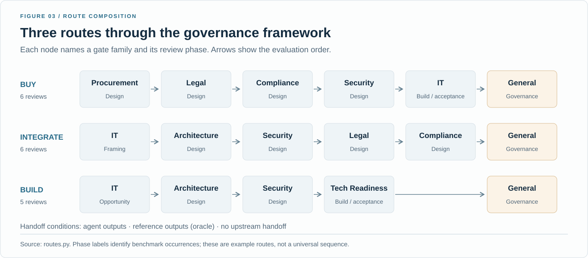
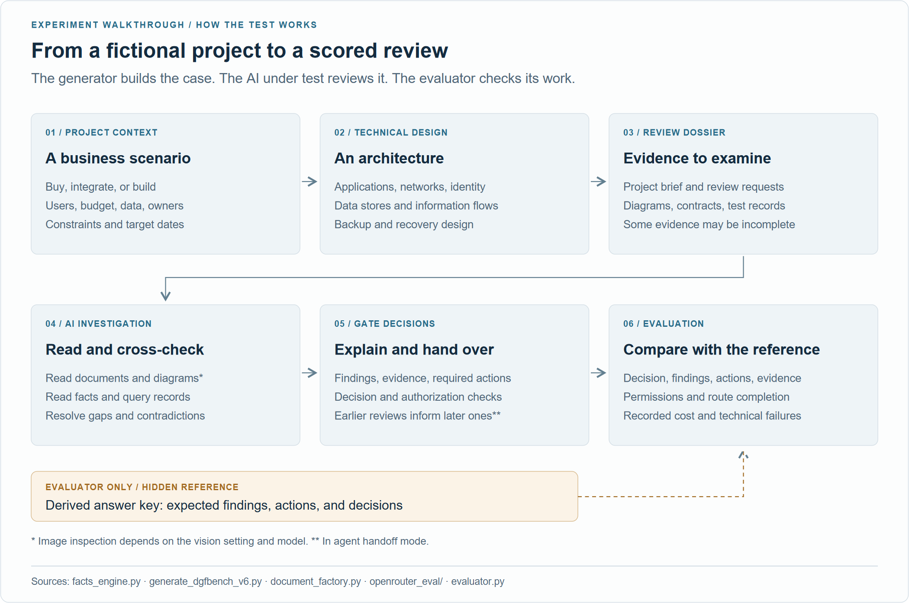
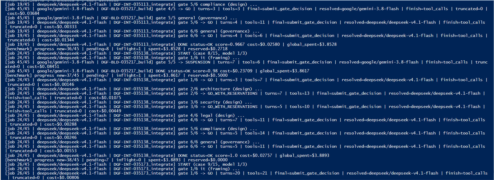
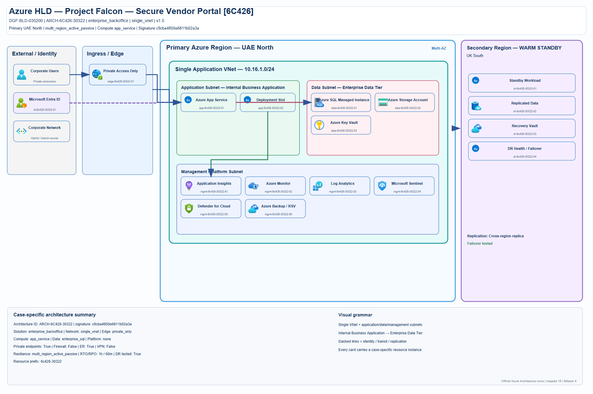
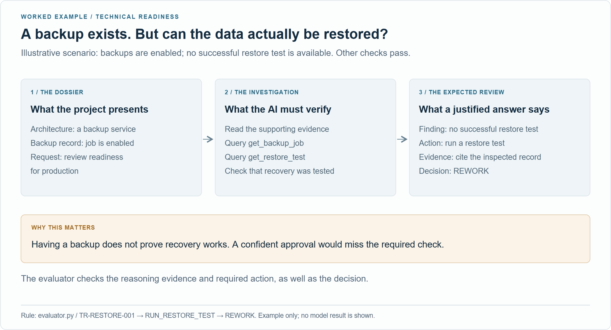
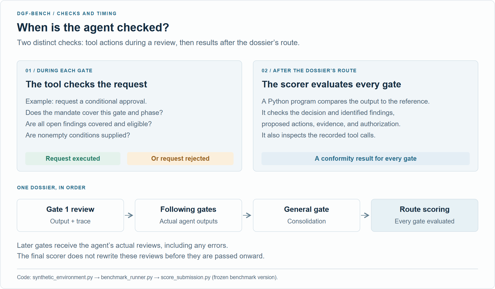
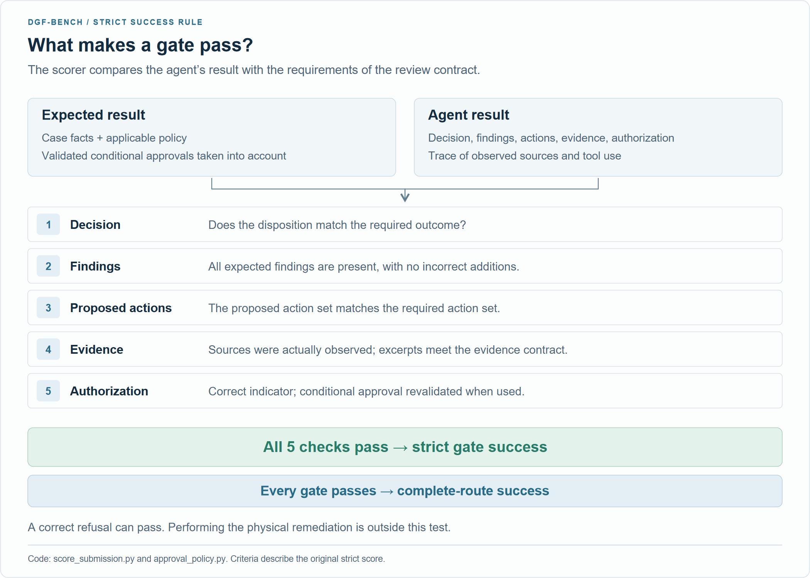
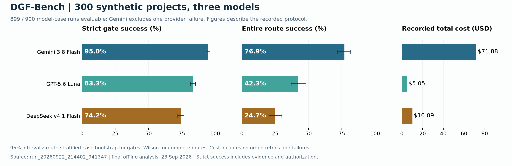
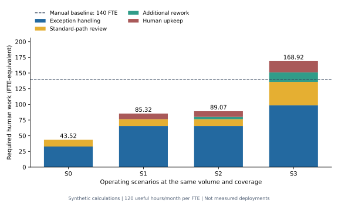
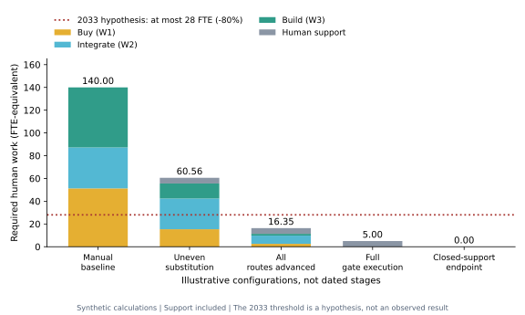

  

<h1 align="center">DGF-Bench · The Last Human Gate</h1>

  <strong>Can AI agents take over the project reviews people perform today?</strong> 
  Research on Forward Deployed Engineering, governance automation, and the human work that remains.

  <strong>Jeremy Canale</strong> 
  <a href="https://www.jeremycanale.com">jeremycanale.com</a> &nbsp; · &nbsp;
  <a href="mailto:contact@jeremycanale.com">contact@jeremycanale.com</a> &nbsp; · &nbsp;
  <a href="https://www.linkedin.com/in/jcanale13">LinkedIn</a>

  <code>300 synthetic projects</code> &nbsp; <code>3 models</code> &nbsp; <code>135 repeated runs</code>

## Two papers, one research project

| Read | What it contains |
|---|---|
| **[Research paper prepared for arXiv · PDF, 28 pages](paper2/From_Governance_Reviews_to_Task_Substitution.pdf)** | **The Last Human Gate: Forward Deployed Engineering for Governance Automation.** Start here: the task-substitution argument, gate contracts, two formal propositions, human-work accounting, detailed methodology, recorded examples, and the consolidated experiments. |
| **[Full thesis / extended manuscript · PDF, 66 pages](paper/The_Last_Human_Gate.pdf)** | **The Last Human Gate: Forward Deployed Engineering and the Automation of Enterprise Governance.** The full research argument, detailed calculations, workforce scenarios, and appendices. |

**[Download the arXiv source ZIP](https://github.com/jeremy1392/dgf-agentic-bench/releases/download/dgf-bench-300-20260923/DGF_Bench_arXiv_source.zip)** · [Submission guide and remaining requirements](paper2/ARXIV_SUBMISSION.md) · [Title, abstract, and metadata](paper2/arxiv_metadata.txt)

The short paper replaces the previous empirical companion. Both manuscripts present the same research and share their data. **Publication status: prepared for submission; no arXiv identifier is confirmed.** The PDF link above is the submission manuscript, not an arXiv record.

  <a href="#the-idea-in-plain-language">The idea</a> &nbsp; · &nbsp;
  <a href="#how-we-test-it">The experiment</a> &nbsp; · &nbsp;
  <a href="#measured-results-300-projects">Results</a> &nbsp; · &nbsp;
  <a href="#workforce-scenarios-and-timelines">Workforce scenarios</a> &nbsp; · &nbsp;
  <a href="#data-and-reproduction">All data</a> &nbsp; · &nbsp;
  <a href="#get-started">Get started</a>

## The idea in plain language

Before a company buys software, connects systems, or launches an application, people check the project's architecture, security, contracts, budget, and readiness. They decide whether it can proceed and what needs to change.

A **gate** is one of these review checkpoints. A **Digital Governance Framework (DGF)** organizes them into a process. A **dossier** contains a project's facts and documents; its **route** is the sequence of reviews it must pass.

**Buy** means purchasing a solution; **Integrate** means connecting existing systems; **Build** means developing an application. Each box is a review of the same project dossier. Buy and Integrate contain six reviews, and Build contains five; **General** consolidates the specialist reviews. Arrows show review order and information handoffs. In the benchmark, scheduled reviews continue even after a refusal. These are the three routes evaluated here; organizations can configure others. [Route definitions](routes.py).

**The research asks when agents and software can replace the review tasks now assigned to people, and how much human work would remain.** DGF is a useful candidate because many reviews have recurring inputs, explicit rules, evidence requirements, and bounded decisions. A governance function can remain necessary even when its execution becomes automated.

### Forward Deployed Engineers: DGF first, business functions next

A **Forward Deployed Engineer (FDE)** works with a company's teams to put AI into its actual processes. In the proposed design, FDEs connect evidence sources, encode policies and permissions, integrate agents, and organize exception handling. Agents investigate and explain; software checks policy and authority; unresolved cases go to people.

Jeremy Canale's hypothesis is that **FDEs will likely tackle DGF before extending these methods to core business functions**. Governance is both a recurring process and something an AI deployment itself must pass through. Evidence access, permissions, and monitoring could then be adapted to workflows such as claims or underwriting. This is an adoption hypothesis; the experiment below evaluates governance reviews. FDE maintenance and support count as human work in the paper's labor account.

## How we test it

**We generate a fictional project and its dossier, let an agent investigate, then score its review against the specified rules.** The tested model is the reviewer; it does not create its own test case.

  

1. **Generate the need.** Buy software, integrate systems, or build an application. Assign owners, users, budget, criticality, and data sensitivity.
2. **Generate the architecture.** Create applications, networks, identity, data flows, and recovery arrangements, with diagrams and technical records.
3. **Build the dossier.** Produce Word documents, supplier and legal records, CSV tables, JSON evidence, and operational tests. Cases can contain missing, stale, or conflicting information.
4. **Let the agent investigate.** Give it the policies, permitted evidence, and tools for querying simulated company systems and requesting authorized actions.
5. **Record and pass on its review.** Collect findings, evidence, required actions, a decision, and its authorization basis. Later gates receive its earlier outputs; General consolidates the route.
6. **Score the work.** Compare the submissions and recorded actions with the evaluator's reference. Preserve the traces, errors, and cost records.

  

*The benchmark in progress.* This capture shows a 45-job batch: each job pairs a model with a dossier, and its gates run in sequence. Lines report decisions such as `GO`, `GO_WITH_RESERVATIONS`, and `SUSPENSION`, conversation turns, tool calls, and recorded costs. `DONE status=OK` means the job completed; correctness is reported by the scoring results. Click the image to read the full-size trace.

**The information condition matters:** agents receive executable policies and authoritative structured `REVIEW_FACTS` alongside the documents. Evaluator-only answer files are hidden. The published scores therefore measure review execution with this support, not independent extraction of every fact from Word files or diagrams.

  

*An actual architecture artifact from the synthetic dataset.* Project Falcon is a fictional HR portal for 1,000 users, with a €500,000 requested budget and confidential data. This is a generated review artifact, not a recommended production design. [Context and provenance](assets/readme/example-project-context.json).

<strong>See a concrete review example</strong>

Backups being enabled does not prove data can be restored. Under the readiness rule, a missing successful restore test requires `REWORK` and an action to run that test, assuming the other checks pass. This illustrates the task; it is not a recorded model answer. [Rule `TR-RESTORE-001`](evaluator.py).

## What we want to measure

| Question | Evaluation |
|---|---|
| **Right decision?** | Approval, conditional approval, rework, suspension, or rejection, as required by the case and validated permissions. Correctly refusing a deficient project counts as success. |
| **Complete review?** | Correct findings and actions, supporting evidence actually read, conforming excerpts, and authorization. |
| **Reliable whole process?** | Every gate in the project's route must pass, including those receiving earlier model outputs. |
| **Practical performance?** | Critical omissions, incorrect approvals, technical failures, repeated-run stability, and recorded inference cost. |

**Strict gate success (Gate CSR)** requires every scoring component to pass. **Complete-route success** requires every gate to pass. A correct decision with a nonconforming citation can fail the strict score; the component breakdown separates these errors. [Scoring and methodology](paper2/sections/02_experiment.tex).

### When and how the agent is checked

**There are two checks at different moments.** During a gate, the simulated environment validates requests such as conditional approval: the agent needs a valid mandate, must cover all open findings, and can only accept risks that the policy permits. The tool executes or rejects the request and returns that result to the agent.

**After the dossier's route, a Python scorer checks the submitted reviews and recorded tool actions against the reference.** Later gates receive the agent's actual earlier outputs, including any mistakes; the scorer does not correct those outputs before the handoff.

  

**A strict gate passes only when all five scoring components pass:** decision, findings, required actions, evidence, and authorization. Valid conditional approvals are replayed against the policy when establishing the expected result. A correct refusal can therefore be a successful review.

  

For example, if a required successful restore test is missing, the reviewer should request the test and return `REWORK`, assuming the other checks pass and no authorized exception applies. The benchmark checks that review and its supporting evidence; it does not run a real restore test. [Illustrated example](assets/readme/experiment-restore-example.png).

[Schémas en français : quand vérifier](assets/readme/verification-timing-fr.png) · [Critères de conformité](assets/readme/verification-criteria-fr.png) · [Diagram sources and code provenance](assets/readme/README.md#verification-diagrams)

## Measured results: 300 projects

The September 2026 study assigned the same **300 dossiers — 100 Buy, 100 Integrate, 100 Build — to three models**. It produced **899 evaluable runs out of 900 planned**, covering **5,094 gates**. One Gemini provider failure is excluded; its recorded cost remains included.

  

| Model | Evaluable projects | Strict gate success | Complete-route success | Recorded cost |
|---|---:|---:|---:|---:|
| **Gemini 3.8 Flash** | 299 / 300 | **94.98%** | **76.92%** (230 projects) | **$71.88** |
| **GPT-5.6 Luna** | 300 / 300 | **83.29%** | **42.33%** (127 projects) | **$5.05** |
| **DeepSeek v4.1 Flash** | 300 / 300 | **74.18%** | **24.67%** (74 projects) | **$10.09** |

Exact endpoints: `google/gemini-3.8-flash`, `openai/gpt-5.6-luna`, and `deepseek/deepseek-v4.1-flash`. All used temperature 0, vision `auto`, agent handoffs, and the same limits: 20 turns, 40 tool calls per gate, and 8,192 output tokens per turn. Dataset generation used difficulty setting 4 and decision-coverage sampling; this is not an estimate of real enterprise case frequencies.

The ranking holds on the 299 projects completed by all three models. Original inference cost totals **$87.02**. [Full results and 95% intervals](research/2026-09-dgf-bench/PAPER_RESULTS.md) · [Paired comparisons](research/2026-09-dgf-bench/paired_comparisons.json).

### What the controls and failures tell us

- **Rules alone suffice in this condition.** A deterministic program passes **1,700/1,700 gates and 300/300 routes** using the public policies and structured facts, without model calls. This demonstrates that the represented review kernel is executable software. It establishes no incremental LLM advantage for this structured task; the control shares rules with the evaluator and has no model output-token limit.
- **Evidence affects the headline score.** Gemini chooses the correct decision at all 1,694 evaluable gates, but fails 85 strict reviews on evidence alone. Evidence is also the only failing component in 221 Luna and 338 DeepSeek reviews. An audit of all **690 evidence-failed gates** raises gate success to 99.06%, 85.53%, and 77.24% under a separate structural matching rule. These post-hoc scores are a sensitivity analysis, not independently judged semantic accuracy.
- **Some errors change the outcome.** DeepSeek records one false approval and one critical omission; Luna records one and three respectively; Gemini records neither in this sample. Authorization tools also reject invalid requests: Gemini makes 466 rejected conditional-approval calls. Final scores describe the agent with these checks in place.

[Rules control and methods](research/2026-09-followup/) · [Evidence audit](research/2026-09-followup/ALL_MODELS_AUDIT.md) · [Authority audit](research/2026-09-followup/conditional_approval_audit.md) · [Source coverage and document counterexample](research/2026-09-followup/source_coverage_audit.md)

### Repeated runs: does the same dossier succeed again?

The follow-up adds **135 runs on 15 existing dossiers**: five per route, each reviewed three more times by each model. All **765 gates** were attempted, at a recorded cost of **$12.56**. These are repeated executions, not additional unique projects.

| Model | Strict gate success | Complete routes | Dossiers passing all three repeats |
|---|---:|---:|---:|
| **Gemini 3.8 Flash** | 96.08% (245/255) | 35/45 | **9/15** |
| **GPT-5.6 Luna** | 82.75% (211/255) | 19/45 | **3/15** |
| **DeepSeek v4.1 Flash** | 73.33% (187/255) | 11/45 | **0/15** |

The gate-success ranking persists, but a particular dossier can succeed on one attempt and fail on another. Repeated trajectories from the same dossier are not independent projects. **Total original and follow-up inference cost: $99.58.** [Repetition results and uncertainty](research/2026-09-followup/REPETITION_RESULTS.md).

### What this means for replacing human work

**The models successfully perform many of the specified governance-review tasks normally assigned to people.** This supports a concrete path to task substitution: make evidence accessible, define the review contract, automate its execution, enforce authority, and route exceptions appropriately.

**Agents can progressively replace human execution across DGF workflows when they meet the review contract and operate under the required authority.** If accepted work needs fewer total human hours at comparable volume and quality, the need for personnel can fall under the staffing conditions specified in the paper. Exceptions, verification, correction, integration, maintenance, and supplier support belong in that total. The experiment measures synthetic review performance; the paper provides the separate operating measurements needed to quantify workforce substitution.

## Workforce scenarios and timelines

**FTE means full-time equivalent (ETP in French): an amount of work.** Two people each spending half their time on DGF contribute one FTE. The paper counts execution and support, including outsourced work, at comparable project volume, quality, and service.

The following figures reproduce the extended manuscript's **synthetic calculations, not observed staffing changes**.

**The same case volume and automation coverage can leave 43.52 or 168.92 FTE.** Exceptions, review, rework, and upkeep determine the difference. This is the workforce comparison retained in the concise paper. [Assumptions and calculations](paper/anc/README.md).

<strong>The broader trajectory from the full thesis</strong>

These configurations range from manual work to assumed complete closure. **They have no assigned dates.** Full gate execution can still require human support; zero FTE additionally assumes that support is automated. The 28-FTE line applies the 80% reduction hypothesis to the illustrative 140-FTE baseline. [Detailed trajectory](paper/sections/s_appE_trajectory.tex).

| Timeline | Hypothesis and test |
|---|---|
| **Original: 2026 → 2033** | Jeremy Canale predicts **80% fewer required DGF FTE by 20 September 2033**, compared with the year ending 20 September 2026. Testing now requires auditable historical baseline records and the same labor boundary at follow-up. This remains an untested forecast. |
| **Separate prospective study** | Register a cohort and measurement plan before a 12-month baseline, then test the same reduction threshold seven years after that baseline ends. No cohort has been enrolled. This protocol neither confirms nor moves the original 2033 deadline. |

[Historical study protocol](paper/anc/cohort_protocol.md) · [Prospective protocol](paper2/protocols/field_cohort.md)

## Data and reproduction

**[Complete experiment release](https://github.com/jeremy1392/dgf-agentic-bench/releases/tag/dgf-bench-300-20260923)** — all source documents, Word dossiers, architecture diagrams, traces, scores, configurations, and frozen benchmark code are available.

| Download | Contents |
|---|---|
| [300-project dataset](https://github.com/jeremy1392/dgf-agentic-bench/releases/download/dgf-bench-300-20260923/dgf-bench-300-dataset.zip) | All dossiers and Word documents, architectures, simulated records, policies, mandates, and evaluator references. References were hidden from the agents. |
| [Complete original run](https://github.com/jeremy1392/dgf-agentic-bench/releases/download/dgf-bench-300-20260923/dgf-bench-300-run.zip) | Responses, tool calls, submissions, scores, billing, configurations, failed attempts, and final analysis. |
| [Frozen benchmark source](https://github.com/jeremy1392/dgf-agentic-bench/releases/download/dgf-bench-300-20260923/dgf-bench-300-source.zip) | Exact code and supporting assets used during collection, including then-uncommitted changes. |
| [135 repetitions](https://github.com/jeremy1392/dgf-agentic-bench/releases/download/dgf-bench-300-20260923/dgf-bench-repetitions-20260924.zip) | Repeated trajectories, scores, costs, and provenance. |
| [Evidence audit and counterexamples](https://github.com/jeremy1392/dgf-agentic-bench/releases/download/dgf-bench-300-20260923/dgf-bench-evidence-audit-20260924.zip) | Audit records and source documents for the offline information checks. |

Use **`analysis_20260923_final`** inside the run archive, or the [browsable final results](research/2026-09-dgf-bench/). Earlier partial exports remain for provenance. Archive inventories and [SHA-256 checksums](research/2026-09-dgf-bench/SHA256SUMS.txt) identify the files. The frozen source is the reproduction reference; the default branch can differ.

The earlier **15-project pilot** is also fully retained: [Word dossiers and architecture diagrams](research/2026-09-pilot/SOURCE_DOCUMENTS.md) · [Pilot files](experiments/run_20260922_180730_063947/). Its GLM results are separate from the 300-project study.

## Get started

**Reproduce the released results without new model calls:** follow the [offline reproduction guide](research/2026-09-dgf-bench/README.md#reproduce-without-api-calls). For new experiments, use the [installation, launch, and resume guide](docs/RUNNING_EXPERIMENTS.md). New inference requires your own API key and budget.

| Resource | Where to go |
|---|---|
| Build and verify the short paper | [LaTeX sources and numerical checks](paper2/README.md#sources-and-reproduction) |
| Build the full thesis | [Extended manuscript sources](paper/README.md) and [numerical reproduction](paper/anc/README.md) |
| Inspect controls and follow-ups | [Executed analyses and methods](research/2026-09-followup/) |
| Explore the illustrations | [SVG/PNG assets and regeneration](assets/readme/README.md) |
| Understand the scope | [How the papers and benchmark relate](docs/PAPER_AND_BENCHMARK.md) |

## Citation and license

Research and project by **[Jeremy Canale](https://www.jeremycanale.com)** · [contact@jeremycanale.com](mailto:contact@jeremycanale.com) · [LinkedIn](https://www.linkedin.com/in/jcanale13).

Use [CITATION.cff](CITATION.cff). The preferred manuscript citation is **Jeremy Canale (2026), *The Last Human Gate: Forward Deployed Engineering for Governance Automation*.** Identify the manuscript revision and, for experiments, the dataset, protocol, and source revision. The two manuscripts share evidence and should not be counted as independent studies.

Original benchmark code and documentation are **MIT OR Apache-2.0**: [LICENSE](LICENSE). The [papers have separate copyright terms](paper/LICENSE-NOTICE.md). Third-party assets, including Azure icons, retain their [own terms](THIRD_PARTY_NOTICES.md). Please preserve author attribution.
