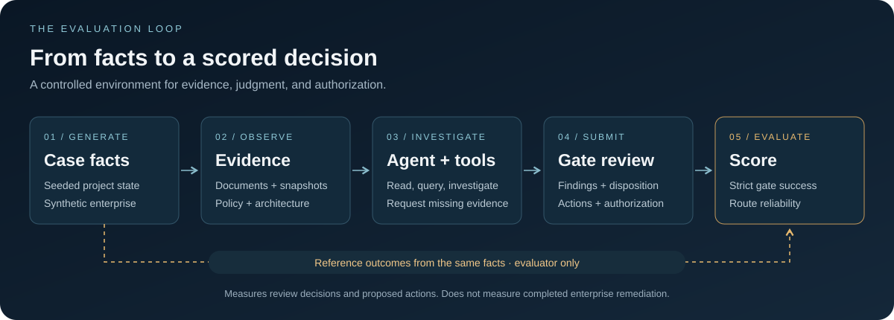
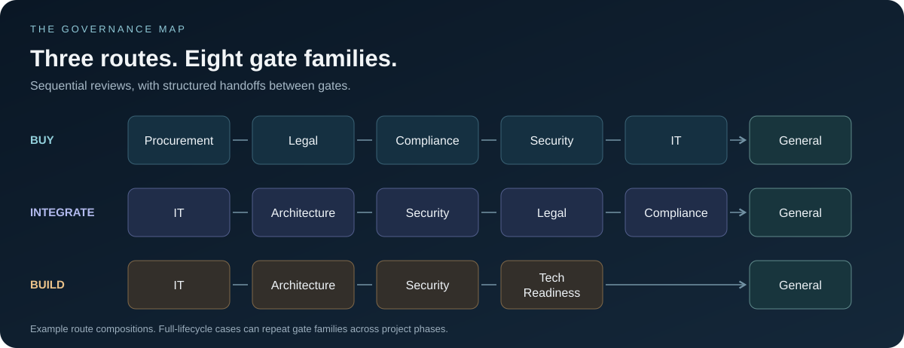

<p align="center">
  <a href="paper/The_Last_Human_Gate.pdf">
    
  </a>
</p>

<h1 align="center">DGF-Bench</h1>

<p align="center">
  <strong>Investigate evidence. Make a decision. Account for every gate.</strong><br />
  A synthetic enterprise governance benchmark and research companion to <em>The Last Human Gate</em>.
</p>

<p align="center">
  <code>8 gate families</code> &nbsp; <code>3 core routes</code> &nbsp; <code>5 dispositions</code>
</p>

<p align="center">
  <a href="paper/The_Last_Human_Gate.pdf"><strong>Read the paper ↗</strong></a> &nbsp; · &nbsp;
  <a href="#how-the-benchmark-works">Explore the benchmark</a> &nbsp; · &nbsp;
  <a href="#get-started">Get started</a> &nbsp; · &nbsp;
  <a href="CITATION.cff">Cite this work</a>
</p>

---

DGF-Bench evaluates tool-using AI agents on governance review tasks: inspect evidence, identify findings, choose a disposition, propose actions, respect authorization rules, and pass structured results to the next gate. Reference outcomes are derived from generated enterprise facts.

| 01 / RESEARCH | 02 / BENCHMARK | 03 / REPRODUCIBILITY |
|---|---|---|
| **The Last Human Gate** | **Governance as a testable task** | **Inspect the assumptions** |
| A theoretical framework for governance automation and residual human work. | Synthetic dossiers, evidence tools, authorization rules, and route-level evaluation. | LaTeX sources, numerical parameters, generated tables, and model traces. |
| [Read the manuscript](paper/The_Last_Human_Gate.pdf) | [Explore the protocol](#how-the-benchmark-works) | [Open the research package](paper/anc/) |

*Jeremy Canale · September 2026. The paper's workforce calculations are synthetic scenarios, not measured deployments. Model evaluations are separate empirical results.*

## How the benchmark works

A case is a synthetic project dossier. A route is an ordered sequence of governance reviews; each review is a gate occurrence. Agents work with documents, factual exports, architecture diagrams, a published policy, and tools for evidence requests and simulated governance actions.

<p align="center">
  
</p>

### Follow the routes

<p align="center">
  
</p>

These routes cover eight gate families. A separate `full_lifecycle` mode repeats gates across project phases. The five possible dispositions are `GO`, `GO_WITH_RESERVATIONS`, `REWORK`, `SUSPENSION`, and `NO_GO`; applicability depends on the gate and phase.

The benchmark reports decision accuracy, finding/action precision and recall, evidence support, authorization correctness, critical misses, false approvals, strict gate success, route success, and token/cost usage. A route succeeds only when every required gate meets the specified scoring contract. Always identify the scoring version when publishing results.

> **What a score means**
>
> This is an evaluation of review decisions, proposed actions, and simulated authorization. It does not measure completed enterprise remediation, production deployment, hours saved, or workforce replacement. A valid refusal can be the correct answer. Strong performance on synthetic cases does not establish the paper's broader automation thesis.

## Get started

### 1. Install

Python 3.10 or later is required. Create an environment, activate it for your shell, and install dependencies:

```text
python -m venv .venv
```

```powershell
# Windows PowerShell
.\.venv\Scripts\Activate.ps1
```

```bash
# Linux / macOS
source .venv/bin/activate
```

```text
python -m pip install -r requirements.txt
```

### 2. Run an experiment

Choose exact model identifiers from the OpenRouter catalog. `MODEL_ID` below is a placeholder:

```text
python discover_openrouter_models.py --min-context 100000 --limit 20
python run_full_experiment.py --models MODEL_ID --preset smoke --regenerate-smoke --workers 1 --max-cost-usd 5
```

The launcher reads `OPENROUTER_API_KEY` from the environment or local `.env`, or prompts for it with hidden input. The smoke command makes paid API calls; offline checks do not. OpenRouter's account balance and API-key spending limit are separate from the script's budget cap.

| Preset | Cases per route | Total cases |
|---|---:|---:|
| `smoke` | 1 | 3 |
| `pilot` | 5 | 15 |
| `paper` | 50 | 150 |

Use `--cases-per-route 100` for 300 newly generated cases across the three main routes. Equal route counts do not imply balanced decisions or findings. For a prepared dataset, its manifest determines the cases used:

```text
python run_full_experiment.py --dataset PATH_TO_DATASET --models MODEL_A MODEL_B MODEL_C --preset paper --workers 6 --max-cost-usd 65
```

The budget shown is an example spending ceiling, not a cost estimate or a guarantee of completion. With 300 cases and three models, the experiment schedules 900 model/case runs. With six workers and three models, the automatic limit is two concurrent cases per model. Gates within a case remain sequential in `agent` handoff mode.

Useful controls include `--temperature`, `--vision`, `--handoff-mode`, `--max-turns`, `--max-tool-calls`, and `--max-output-tokens`; inspect `python run_full_experiment.py --help` for the options in your checkout. Handoff modes are `agent` (model outputs), `oracle` (reference outputs), and `none`.

## Read the results

Each new one-command experiment writes to `experiments/run_<timestamp>/`:

| Location | Contents |
|---|---|
| `experiment_config.json` | Models, dataset path, generation and execution settings |
| `results/` | Per-model, per-case traces, submissions, scores, and usage records |
| `paper_outputs/PAPER_RESULTS.md` | Human-readable results |
| `paper_outputs/` | Aggregate JSON, CSV tables, and a LaTeX summary table |

Inspect evaluated, excluded, and unfinished case counts before interpreting scores. Infrastructure failures are not evidence of incorrect model decisions. Compare models on common completed cases and report coverage by route. Gates from the same case are dependent observations; 1,700 gates from 300 dossiers are not 1,700 independent dossiers.

<details>
<summary><strong>Resume an interrupted experiment</strong></summary>

For a compatible interrupted run, use `run_openrouter_benchmark.py` with the **original dataset, models, results directory, and execution settings**. This lower-level runner supports resumption; avoid `--no-resume`. Retain the original code and data, and follow any compatibility checks implemented by that protocol version. A new `run_full_experiment.py` invocation creates a new experiment rather than continuing the previous one.

After a lower-level resume, regenerate aggregates:

```text
python aggregate_openrouter_results.py --results PATH_TO_EXISTING_RESULTS
```

This updates the aggregate JSON in the results directory. It does not refresh the one-command launcher's separate `paper_outputs` tables. Existing exports must be regenerated before publication.

</details>

## Research use and reproducibility

- Freeze the dataset, prompts, model settings, and scoring protocol before evaluation. Keep development cases separate from the final test set.
- Record the repository commit and local changes, model/provider identity, seed, difficulty, routes, sampling policy, exclusions, and costs.
- State whether sampling follows the generator distribution or conditions cases on target decisions. Coverage balancing is not an estimate of real enterprise prevalence.
- Keep hidden reference files, including `99_hidden_ground_truth.json`, outside agent-visible evidence.
- Validate a sample independently. Reusing the reference evaluator to check public observations establishes internal consistency, not independent business validity.
- Report uncertainty at the case level and distinguish decision correctness from evidence-format compliance. Do not treat partial runs as completed studies.

Historical datasets and generators remain in the repository for reproducibility; they are not automatically compatible with newer scoring protocols or suitable as held-out evaluation data.

## Offline checks and paper build

The following checks do not call paid model APIs:

```text
python self_test_v6.py
python smoke_test_openrouter_harness.py
python self_test_multimodel_protocol.py
python self_test_uniqueness.py
python paper/anc/test_reproduce.py
```

With LaTeX, `latexmk`, and Make installed:

```text
make paper
```

This builds `paper/The_Last_Human_Gate.pdf`. The [paper README](paper/README.md) documents the direct LaTeX build; the [reproduction package](paper/anc/README.md) explains the numerical assumptions and generated tables.

<details>
<summary><strong>Repository map and further reading</strong></summary>

| Path | Role |
|---|---|
| `paper/` | Manuscript, compiled PDF, and synthetic calculations |
| `facts_engine.py`, `evaluator.py` | Case facts and reference rules |
| `generate_dgfbench_v6.py`, `prepare_openrouter_experiment.py` | Case and dataset generation; filenames retain historical version names |
| `openrouter_eval/` | Agent loop, tools, provider client, runner, and aggregation |
| `score_submission.py` | Scoring against reference outcomes |
| `synthetic_environment.py` | Simulated evidence queries and governance actions |
| `docs/` | Design, gate coverage, and protocol documentation |

See [the paper/benchmark relationship](docs/PAPER_AND_BENCHMARK.md) for the boundary between theoretical claims and empirical evaluation. Release history belongs in [CHANGELOG.md](CHANGELOG.md).

</details>

## Citation and license

Use [CITATION.cff](CITATION.cff) to cite the paper. For benchmark experiments, also cite DGF-Bench and identify the repository commit, protocol, and dataset configuration.

Original benchmark code and documentation are dual-licensed under **MIT OR Apache-2.0**; see [LICENSE](LICENSE). The [paper has separate copyright terms](paper/LICENSE-NOTICE.md). Microsoft Azure icons and other third-party assets retain their own terms, documented in [THIRD_PARTY_NOTICES.md](THIRD_PARTY_NOTICES.md).

<p align="center">
  <a href="paper/The_Last_Human_Gate.pdf"><strong>The Last Human Gate</strong></a><br />
  <sub>Can AI Automate Enterprise Governance?</sub>
</p>
