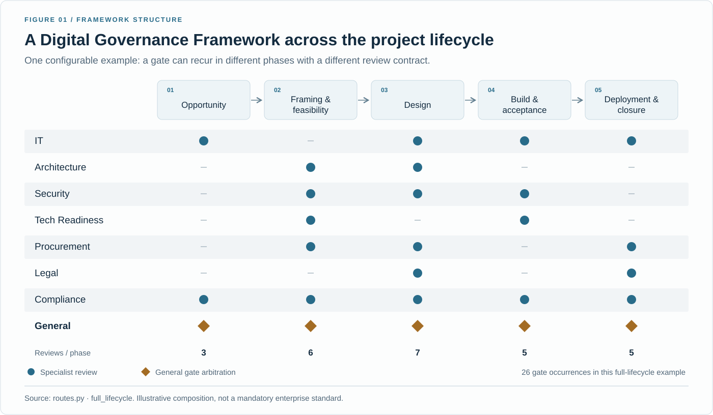
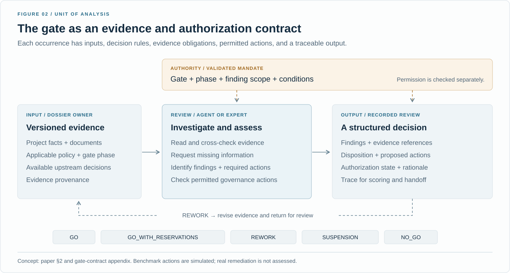
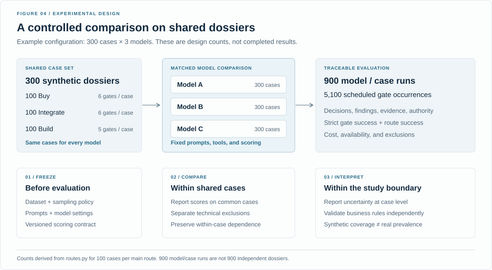

<p align="center">
  <a href="paper/The_Last_Human_Gate.pdf">
    
  </a>
</p>

<h1 align="center">DGF-Bench</h1>

<p align="center">
  Research and project by <strong>Jeremy Canale</strong><br />
  <a href="https://www.jeremycanale.com">jeremycanale.com</a> &nbsp; · &nbsp;
  <a href="mailto:contact@jeremycanale.com">contact@jeremycanale.com</a> &nbsp; · &nbsp;
  <a href="https://www.linkedin.com/in/jcanale13">LinkedIn</a>
</p>

<p align="center">
  <strong>The Last Human Gate: Forward Deployed Engineering and the Automation of Enterprise Governance</strong><br />
  DGF-Bench tests whether AI agents can review projects, spot problems, and make justified decisions.
</p>

<p align="center">
  <code>8 types of review</code> &nbsp; <code>3 project paths</code> &nbsp; <code>5 possible decisions</code>
</p>

<p align="center">
  <a href="paper2/From_Governance_Reviews_to_Task_Substitution.pdf"><strong>Read the empirical paper ↗</strong></a> &nbsp; · &nbsp;
  <a href="paper/The_Last_Human_Gate.pdf">Read the broader thesis ↗</a> &nbsp; · &nbsp;
  <a href="#forward-deployed-engineers-dgf-first-business-functions-next">The role of FDEs</a> &nbsp; &middot; &nbsp;
  <a href="#what-we-want-to-measure">What we measure</a> &nbsp; · &nbsp;
  <a href="#how-we-test-it">Inside the experiment</a> &nbsp; · &nbsp;
  <a href="#measured-results-300-projects">Results &amp; data</a> &nbsp; · &nbsp;
  <a href="#two-research-timelines">Timelines</a> &nbsp; · &nbsp;
  <a href="#get-started">Get started</a> &nbsp; · &nbsp;
  <a href="CITATION.cff">Cite this work</a>
</p>

---

**One research project, two complementary papers.** This page brings together the project's broader vision, measured results, and proposed field studies. *The Last Human Gate* develops the automation argument and workforce scenarios. *DGF-Bench: Rule Application and Evidence Reliability in Synthetic Governance Reviews* focuses on the benchmark and adds an executed rules comparator, evidence audit, and repeated model trials. [Compare the two papers](#two-papers-one-research-project).

## The idea in plain language

Before a company buys software, connects two systems, or launches a new application, people review the project. They check its security, contracts, budget, technical design, and readiness for use. They decide whether it can proceed and what needs to change.

**We want to measure how reliably an AI can perform these reviews when it has documents, clear rules, and tools to investigate.** Can it find the important problems, justify its decision with evidence, respect its authority, and pass useful information to the next reviewer?

A **gate** is one review checkpoint, such as Security or Legal. A **Digital Governance Framework (DGF)** is the way a company organizes these checkpoints. A **route** is the sequence of checkpoints followed by a project. A **dossier**, or case, is the project's collection of facts and documents.

### The bigger question: how much human work will DGF still need?

**Jeremy Canale's original hypothesis, developed in *The Last Human Gate*: by 2033, the DGF ecosystem will require 80% fewer full-time equivalents (FTE) than in 2026, for comparable project volume, quality, and service.** In that paper's illustrative baseline, this means **140 FTE in 2026 and at most 28 FTE in 2033**, including human supervision and support.

The second paper proposes a separate prospective test: measure a registered baseline year, then test for an 80% reduction **seven years after that baseline ends**. No enterprise cohort has yet been enrolled. The original 2033 prediction remains a historical hypothesis requiring auditable 2026 records. [Both timelines and their status](#two-research-timelines).

**FTE means full-time equivalent, or ETP in French.** It measures an amount of work. Two people each spending half their working time on DGF contribute one FTE together. It does not mean one individual employee. The first paper's illustrations convert human work into FTE using a stated convention of 120 useful hours per month.

The scope spans architecture, security, operations, technical readiness, compliance, project support, and related procurement, legal, and finance work. Exceptions, rework, maintenance, and supplier support stay in the account. Moving work to a contractor does not eliminate it.

DGF-Bench tests an early part of the argument: whether AI performs reviews reliably. **The capability question is whether LLMs can carry out the decisions normally assigned to human gate reviewers: examine a dossier, identify problems, justify a decision, and act within their authority.** The FTE reduction is a research hypothesis; confirming it requires measuring human work in organizations. Individual headcount, staffing choices, and employment effects are separate outcomes.

### Forward Deployed Engineers: DGF first, business functions next

A **Forward Deployed Engineer (FDE)** works alongside a company's teams to make software and AI work in their real environment. In the paper's proposed approach, the FDE connects the documents and systems, turns review rules into executable checks, tests the agents with domain experts, obtains the necessary permissions, and makes information flow between reviews.

**Jeremy Canale's hypothesis is that FDEs will likely tackle the DGF first, then extend the same approach to the company's core business activities.** The DGF is a likely starting point because governance reviews have recurring inputs, evidence requirements, rules, and decisions. Security, architecture, procurement, and compliance also recur across companies, making some deployment patterns reusable. An AI project itself must pass through these reviews: the FDE encounters the DGF both as a process to navigate and as a process to automate.

| Proposed progression | In plain language | Examples |
|---|---|---|
| **First: automate DGF work** | Help automate how the company checks, authorizes, and prepares its projects. | Review a supplier dossier, check security evidence, identify a contract issue, or verify readiness for deployment. |
| **Then: extend to business activities** | Apply the methods to the work through which the company delivers its products and services. | Assess an insurance claim, prepare an underwriting decision, or evaluate a loan application. |

The connection is the workflow: **read a dossier, investigate missing information, apply rules, produce a justified decision, and pass it to the next step.** An FDE can reuse evidence handling, permissions, evaluation methods, and monitoring while adapting them to each profession's rules and risks. The paper argues for designing this across the whole process, even when deployment proceeds one gate at a time.

This is a proposed order of development, not a claim that every company will follow it or that business automation must wait until every DGF gate is automated. Sector-specific rules, available data, and economics can change the order. **DGF-Bench evaluates the governance-review part; it does not test insurance or banking work, establish this adoption sequence, or measure FDE productivity.**

The FDE's own effort stays in the labor account. Initial implementation is a transition investment; recurring adaptation, evaluation, maintenance, and support remain in the required FTE. The first paper's **80% FTE-reduction hypothesis for 2033 concerns the DGF ecosystem**, including that support; it is not automatically a forecast for every business profession. [Broader FDE and business-automation argument](paper/sections/s17_fde.tex) · [Deployment discussion in the second paper](paper2/sections/04_deployment.tex).

### A concrete example

Imagine a company wants to buy a cloud application. The supplier looks suitable, but some customer references have not been checked and a contract clause needs attention.

The AI must read the relevant evidence, identify which rules apply, explain the problems, and propose the required next steps. It may need to ask for information or check whether someone has authorized acceptance of a particular risk. Then it must choose the decision allowed by the rules.

**An approval is not automatically a success.** If the correct response is to request changes, wait, or reject the project, that is what a successful AI should do.

## What we want to measure

| In everyday terms | What we check |
|---|---|
| **Does it make the right decision?** | Does its decision match the rules for this particular case? |
| **Does it find the problems and suggest the right fixes?** | Which required problems and actions did it identify, miss, or invent? |
| **Can it show why?** | Did it actually read the relevant evidence and provide valid supporting excerpts? |
| **Does it stay within its authority?** | Does it respect approval conditions and permissions? Does it approve something that should be blocked? |
| **Can it get the whole project review right?** | Does every required checkpoint succeed, including those that receive information from earlier reviews? |
| **What does it cost, and does it finish?** | How many calls and tokens are used, what is the recorded cost, and how many cases complete or fail technically? |

### How to read a score

The strict **gate success rate**, called **Gate CSR** in the reports, is the percentage of review checkpoints that meet *all* the scoring requirements: decision, identified problems, proposed actions, evidence, and authorization.

**Complete-route success** is stricter: every checkpoint in the project's route must pass. For example, if an AI gets four of a five-checkpoint project's reviews completely right, its gate success rate on that project is 80%, but that project's route is not complete. This is an illustration, not an experimental result.

The reports also show the individual components. This matters because an AI can reach the correct decision yet fail the evidence requirement. For example, an excerpt that rearranges source text can fail the exact-quotation rule. We distinguish those errors from an incorrect decision.

A **critical miss** means the AI failed to identify a problem classified as critical by the benchmark. A **false approval** means it allowed a project to proceed when the applicable rules and validated permissions required changes, a pause, or rejection.

## How we test it

**We create a fictional project, prepare its review dossier, and ask an AI to judge whether it can move forward.** Because we know the underlying facts, we can check whether the AI found the problems and made the decision required by the rules.

<p align="center">
  <a href="assets/readme/experiment-walkthrough.svg"></a>
</p>

### 1. Generate a business scenario

We start with a need: **buy a solution, integrate systems, or build an application**. The generator assigns a project context: business unit, owners, users, budget, dates, data sensitivity, and business criticality. These details determine what the reviews need to check.

For example, one generated Build case is **Project Falcon — Secure Vendor Portal**: an HR project affecting **1,000 users**, with a **€500,000 requested budget**, **confidential data**, and **high business criticality**. These are synthetic project facts, not a real customer's information. [Example context and provenance](assets/readme/example-project-context.json).

The generator uses code, rules, and templates to construct the cases. **The model being evaluated acts as the reviewer**; it is not being graded on inventing the business need or designing the architecture.

### 2. Generate the architecture

The project gets a technical design: applications, networks, identity, data stores, information flows, and recovery arrangements. The generator produces both structured facts and a diagram that a reviewer can examine alongside the other evidence.

<p align="center">
  <a href="assets/readme/example-architecture.png"></a>
</p>

**A real artifact from the synthetic dataset.** This is the architecture document generated for the example above, not a decorative drawing or a recommended production design. Its claims must be checked against the rest of the evidence. Image inspection depends on the model and the experiment's vision setting. [Open full-size image](assets/readme/example-architecture.png) · [SVG source](assets/readme/example-architecture.svg).

### 3. Build the dossier the reviewers receive

The generator turns the project facts into documents and records for the relevant gates. Each review has a request explaining its objective, access to allowed evidence, decision rules, and a required answer format.

| Part of the dossier | Examples | What the reviewer is trying to establish |
|---|---|---|
| **Project brief** | Owners, scope, budget, users, dates | What is being proposed, and who is responsible? |
| **Architecture evidence** | Diagram, technical design, network and data-flow tables | Does the design satisfy the project's constraints? |
| **Security and access evidence** | Identity assignments, vulnerability records, monitoring evidence | Are the required protections in place? |
| **Supplier, legal, and compliance evidence** | Supplier records, contract versions, applicable requirements | Are the necessary checks and obligations satisfied? |
| **Readiness evidence** | Backup jobs, restore and failover tests, runbooks | Is there evidence the service can operate and recover? |

The exact contents depend on the route and gate. Files include Word documents, CSV tables, JSON records, and architecture images. **Some cases contain missing, stale, or conflicting evidence.** The challenge is to cross-check the claims, not simply repeat the project's presentation. Different cases vary in project context, technical design, problems, and expected decisions.

### 4. Let the AI investigate

The AI reads the available evidence and can query **simulated company systems**. For example, it can inspect an asset record, check access rights, retrieve a contract version, or look up a restore test. It can also request missing evidence and record required governance actions within its permissions.

These tools return information from the synthetic environment. They do not inspect a real customer's cloud or deploy changes. The trace records what the AI consulted and what it did.

### 5. Collect decisions and pass them to the next review

At each checkpoint, the AI submits **the problems it found, supporting evidence, required actions, its decision, and the authorization basis**. A successful answer can be an approval, a conditional approval, a request for changes, a pause, or a rejection: it depends on the case.

In the normal `agent` handoff mode, later reviews receive the AI's earlier outputs. The final General review brings those conclusions together. This lets us examine both individual reviews and the effect of passing information through a whole project route.

<p align="center">
  <a href="assets/readme/experiment-restore-example.svg"></a>
</p>

**A simple example of the reasoning we test.** Backups being enabled does not prove that data can be restored. Under the benchmark's readiness rule, a missing successful restore test requires `REWORK` and a request to run that test, assuming the other checks pass. This is an illustrative scenario, separate from the architecture specimen above; it is not a recorded model answer or a performance result. [Rule: `TR-RESTORE-001`](evaluator.py).

### 6. Score the work against a hidden reference

The evaluator knows the underlying case facts and the expected findings, actions, and decisions. **The AI receives the allowed evidence and rules, but cannot access that answer key through its tools.** We compare the submitted review and its recorded actions with this reference, including evidence use and permissions.

We then report success by gate and complete route, missed critical problems, false approvals, technical failures, and recorded cost. The same cases can be given to several models for comparison. A well-written answer alone is not enough: its decision and supporting work must satisfy the checks described [above](#what-we-want-to-measure).

For the implementation, follow the [experiment runner](run_full_experiment.py), [case generator](generate_dgfbench_v6.py), [document generator](document_factory.py), [agent tools](openrouter_eval/agent_tools.py), and [reference rules](evaluator.py). The [visual sources](assets/readme/README.md) identify which images are explanatory diagrams and which are generated evidence.

## How project reviews work

### Where reviews happen during a project

<p align="center">
  <a href="assets/readme/dgf-lifecycle-matrix.svg"></a>
</p>

**Figure 1 — A project can be reviewed more than once.** Read this grid from left to right as the project progresses. A blue dot means that type of specialist review is used at that stage. An amber diamond is the General review, which brings the other conclusions together. This full-lifecycle example contains 26 reviews; it is separate from the shorter Buy, Integrate, and Build routes below. Companies can organize these reviews differently. [Source: route definitions](routes.py).

### What happens inside one review

<p align="center">
  <a href="assets/readme/gate-contract.svg"></a>
</p>

**Figure 2 — Read, investigate, explain, decide.** Having an opinion that a risk is acceptable does not automatically give the reviewer permission to accept it. The authorization checks establish what is allowed. The return arrow shows what requesting changes means; it does not claim that the benchmark carries out those changes in a real company. [Source: the paper's gate example](paper/sections/s_appF_contract.tex).

| Decision in the report | Plain-language meaning |
|---|---|
| `GO` | Proceed. |
| `GO_WITH_RESERVATIONS` | Proceed with stated conditions, under the applicable authorization rules. |
| `REWORK` | Make the required changes and bring the dossier back for review. |
| `SUSPENSION` | Wait for a prerequisite, information, funding, or arbitration. |
| `NO_GO` | Do not proceed with the proposal as submitted. |

### Three kinds of project

<p align="center">
  <a href="assets/readme/dgf-main-routes.svg"></a>
</p>

**Figure 3 — Different projects follow different paths.** Buy and Integrate use six checkpoints; Build uses five. In the normal `agent` setting, the next checkpoint receives the AI's earlier review outputs. The `oracle` setting supplies reference outputs instead, and `none` omits those messages. Comparing these settings can help study whether the information passed between reviews affects performance. [Source: route definitions](routes.py).

## How we compare models

<p align="center">
  <a href="assets/readme/research-design.svg"></a>
</p>

**Figure 4 — The comparison plan.** The illustrated setup uses 300 different projects, each reviewed by three models. That means 900 runs, not 900 different projects. The 5,100 checkpoints include repeated reviews of the same projects across models. These numbers describe the study design; they do not say how much of an experiment has finished.

We compare models on cases they have all completed. A provider outage or an exhausted API-key budget is recorded separately from a wrong answer. If a run stops early, the remaining cases are missing observations, not evidence that the AI passed or failed their reviews.

The [figure sources and regeneration command](assets/readme/README.md) are included, with SVG and high-resolution PNG downloads.

## Measured results: 300 projects

**The completed September 2026 evaluation contains 899 evaluable model/project runs out of 900 planned:** the same 300 fictional projects were assigned to three models. DeepSeek and Luna completed all 300; one Gemini run ended in a provider error and is excluded. The dataset contains 100 Buy, 100 Integrate, and 100 Build projects.

The [paper's experimental section](paper/sections/s18_benchmark_results.tex) explains the complete method, exact models and settings, what each agent receives and does, scoring, and conclusions. It follows two recorded cases: Project Falcon's justified conditional approval and an architecture review whose decision is correct but whose evidence excerpt fails the exact-quotation requirement. [Trace excerpts and provenance](research/2026-09-dgf-bench/worked_examples.json).

<p align="center">
  <a href="research/2026-09-dgf-bench/results_overview.svg"></a>
</p>

| Model | Evaluable projects | Gates fully correct | Every gate in the project correct | Recorded cost |
|---|---:|---:|---:|---:|
| **Gemini 3.8 Flash** | 299 / 300 | **94.98%** | **76.92%** (230 projects) | **$71.88** |
| **GPT-5.6 Luna** | 300 / 300 | **83.29%** | **42.33%** (127 projects) | **$5.05** |
| **DeepSeek v4.1 Flash** | 300 / 300 | **74.18%** | **24.67%** (74 projects) | **$10.09** |

**What does this mean?** Gemini performs best among the three tested models. Luna achieves a higher strict score than DeepSeek at a lower recorded cost. The ranking also holds on the **299 projects completed by all three models**, so it is not explained by Gemini's one missing project. Total recorded expenditure is **$87.02**, including recorded retries and failed attempts. [Full tables, denominators and 95% intervals](research/2026-09-dgf-bench/PAPER_RESULTS.md) · [Paired comparisons](research/2026-09-dgf-bench/paired_comparisons.json).

### What the new rules comparator adds

**A conventional program also completes these reviews: 1,700/1,700 strict gates and 300/300 routes, without model calls.** It executes the public rules on the structured facts already available to the agents. This supports the feasibility of automating the represented work. It also shows that this particular test does not establish an added benefit from using a language model: applying the supplied rules is sufficient.

This comparator quotes complete observed JSON records and has no model output-token limit. Its rules share their definitions with the evaluator, so it checks whether the supplied rules and facts suffice; it does not independently validate those business rules. Model API cost is zero; programming effort and local computation are not priced. [All comparator submissions, observations, scores, and methodology](research/2026-09-followup/).

**The structural audit now covers all three models:** 690 gates with failed evidence components. It asks whether a failed excerpt preserves exact field values from one source object the agent actually read, allowing subsets of fields, different field order, and equivalent numeric formats. With this *post-hoc* tolerance, gate success is 99.06% for Gemini, 85.53% for Luna, and 77.24% for DeepSeek; complete-route success is 94.98%, 48.00%, and 28.33%. **These are sensitivity results, not replacements for the original strict scores or independently judged semantic accuracy.** No excerpts or tool reads were repaired. [Full analysis, Procurement errors, confusion matrices, and original quotes](research/2026-09-followup/ALL_MODELS_AUDIT.md). [Download all audit records and counterexample documents](https://github.com/jeremy1392/dgf-agentic-bench/releases/download/dgf-bench-300-20260923/dgf-bench-evidence-audit-20260924.zip).

**A fair document-reading test needs the right information.** Our offline check produced two variants with identical text in all 26 Word documents, yet one requires approval and the other rework: the distinguishing due-diligence status lives in a CSV. Simply hiding the structured facts and retaining only Word files would make this example unanswerable. We have published the counterexample and a [matched-information ablation protocol](paper2/protocols/scaffold_ablation.md); paid ablations have not been run.

**The way a model uses permission also matters.** On the same 391 eligible specialist reviews, Gemini uses conditional approval on 391, Luna on 347, and DeepSeek on 201. These are authorized actions under this benchmark, including cases already conditional; they do not establish a general appetite for risk. Gemini also makes 466 rejected approval requests on 294 ineligible reviews, showing why the tool's authorization checks matter. [Exact counts and method](research/2026-09-followup/conditional_approval_audit.md).

**Some rejected citations really do come from the right source.** In Procurement, DeepSeek supplies 25 exact rows from CSV files it read, covering 23 reviews. The frozen contract excludes those sources because it requires the snapshot identifier. All 205 support entries inspected in failed Procurement findings cite sources actually read. That does not make every argument complete: some quotes omit a necessary premise. [Trace-based source audit](research/2026-09-followup/procurement_source_report.md).

**Removing the snapshots needs more preparation than hiding a file.** The audit now covers all 300 dossiers. Two missing facts are demonstrated in the generated source artifacts; an extension supplies targeted CSV records in three new development cases. A tool can also return the snapshot indirectly, so the future test needs a controlled source-only interface. [Coverage and limitations](research/2026-09-followup/source_coverage_audit.md) · [Prototype that copies cited values automatically](research/2026-09-followup/SOURCE_LOCATION_CONTRACT.md).

**A correct decision is only part of the job.** Gemini chooses the expected decision on every evaluable gate, but 85 gates fail the evidence requirements: supporting excerpts or observed references are missing or nonconforming. Evidence is also the only failing component in 221 of Luna's 284 failed gates and 338 of DeepSeek's 439. We retain the original strict rule: a convincing conclusion without the required trace is not a fully successful review.

**Some failures are substantive.** DeepSeek records one critical omission and one incorrect approval; Luna records three critical omissions and one incorrect approval. Gemini records neither in the evaluable sample. These are observed counts, not a guarantee of safety. One DeepSeek approval was an empty “placeholder” answer at the turn limit; one Luna approval contradicted its own explanation that changes were required. [Detailed analysis in French](research/2026-09-dgf-bench/ANALYSE_FR.md).

**Implication for automation:** these results provide evidence that models can perform many of the specified DGF reviews successfully, supporting the prospect of automating work now assigned to people. The agents operate with explicit rules and accessible structured facts. Extending this performance to operational governance requires evaluating tacit rules, real evidence, exception handling, and the human effort that remains. The workforce charts below model that potential consequence; they are separate synthetic scenarios.

### Download the complete experiment and reproduce the results

**[Complete experiment release — dgf-bench-300-20260923](https://github.com/jeremy1392/dgf-agentic-bench/releases/tag/dgf-bench-300-20260923)**

| Download | Contents |
|---|---|
| [Complete run archive](https://github.com/jeremy1392/dgf-agentic-bench/releases/download/dgf-bench-300-20260923/dgf-bench-300-run.zip) | All recorded model traces, tool calls, submissions, scores, billing ledgers, configurations, checkpoints, earlier failed attempts, historical exports, and final analysis files. |
| [Complete dataset archive](https://github.com/jeremy1392/dgf-agentic-bench/releases/download/dgf-bench-300-20260923/dgf-bench-300-dataset.zip) | All 300 dossiers, documents, architectures, simulated evidence, policies, mandates, manifests, and evaluator reference files. Reference files were hidden from the agents during the experiment. |
| [Exact benchmark source snapshot](https://github.com/jeremy1392/dgf-agentic-bench/releases/download/dgf-bench-300-20260923/dgf-bench-300-source.zip) | The benchmark code and supporting assets used by this experiment, including local changes present during collection. Use this snapshot for reproduction rather than assuming the default branch is identical. |

The archives are GitHub release assets; the final tables and figures are also browsable directly in [the research directory](research/2026-09-dgf-bench/). Each archive has a per-file inventory, and [SHA-256 checksums](research/2026-09-dgf-bench/SHA256SUMS.txt) verify the downloads. **[Offline reproduction instructions](research/2026-09-dgf-bench/README.md)** require no API key or new model calls.

The run archive deliberately retains earlier partial `paper_outputs` for provenance. **Use `analysis_20260923_final` or the research directory for the final results.**

**Earlier pilot — all files browsable on GitHub:** [`run_20260922_180730_063947`](experiments/run_20260922_180730_063947/) contains all 15 original project dossiers, 380 Word documents, 15 architecture diagrams in PNG and SVG, and every recorded trace, score, configuration, and report (2,214 files). **[Open the Word dossiers and architecture diagrams](research/2026-09-pilot/SOURCE_DOCUMENTS.md)** · [Pilot inventory and context](research/2026-09-pilot/). This pilot used GLM alongside DeepSeek and Gemini; its historical results are separate from the 300-project evaluation above.

## Repeated runs: does the same dossier succeed again?

The follow-up completed **135 additional runs** on **15 existing dossiers**: five Buy, five Integrate, and five Build, reviewed three times by each model. All 765 gates were attempted. Total recorded cost was **$12.56**, including failed attempts. These are new executions of existing cases, not 135 new projects.

| Model | Strict gates across all three repeats | Complete routes across all repeats | Dossiers passing all three times |
|---|---:|---:|---:|
| **Gemini 3.8 Flash** | **96.08%** (245/255) | **77.78%** (35/45) | **9/15** |
| **GPT-5.6 Luna** | **82.75%** (211/255) | **42.22%** (19/45) | **3/15** |
| **DeepSeek v4.1 Flash** | **73.33%** (187/255) | **24.44%** (11/45) | **0/15** |

**The gate-success ranking holds in each repeat, but reliability for a particular project varies.** Luna and DeepSeek tie on complete-route success in the third repeat, with 4/15 routes each. Gemini makes the correct disposition at all 255 gates; its ten strict failures concern evidence conformity. None of the models records a scored false approval or critical miss in this small follow-up. DeepSeek completes some routes in each repeat, but no dossier succeeds on all three attempts.

The sample contains only 15 distinct dossiers. Uncertainty calculations resample whole dossiers within each route, keeping their gates and three trajectories together. Provider routing and infrastructure resumes are recorded; the results do not isolate intrinsic model randomness. The original 300-project results remain separate.

[Per-repeat results, intervals, costs, and provenance](research/2026-09-followup/REPETITION_RESULTS.md) · [Complete follow-up archive](https://github.com/jeremy1392/dgf-agentic-bench/releases/download/dgf-bench-300-20260923/dgf-bench-repetitions-20260924.zip).

## What this study can tell us

**The tested models demonstrate strong capabilities in reviewing synthetic enterprise-governance cases under explicit rules.** Gemini achieves 94.98% strict gate success and completes every review successfully on 76.92% of its evaluable project routes. These results support the prospect of substantial automation of the review tasks represented in the benchmark.

**If comparable performance is achieved in operational settings, automating these tasks could reduce the human effort and staffing required for DGF reviews.** This includes the possibility of replacing work currently performed by employees. The scale of that reduction depends on the human work still needed for exceptions, oversight, corrections, integration, and maintenance; model success rates cannot be converted directly into FTE savings.

The rules comparator strengthens the finding that these structured reviews can be automated. The added value of language models for extracting facts from documents, resolving ambiguity, or handling less structured operational evidence remains to be measured separately.

The experiment measures review performance, recorded errors, downstream reviews, and inference costs. The first paper's **80% fewer required DGF FTE by 2033** prediction and the second paper's **seven-year prospective hypothesis** concern workforce consequences. Neither is a measured staffing reduction; both require evidence on human work at comparable output and quality, under their respective timelines.

The test cases are generated, so their variety and rules matter. Balancing the dataset to include different decisions helps test more situations; it does not tell us how common those situations are in business. Agreement with the program that generated the answer key establishes internal consistency; it does not establish the business validity of every rule.

The same post-hoc evidence audit has also been applied to the **135 repetition runs**. Relaxed gate counts are 249/255 for Gemini, 217/255 for Luna, and 195/255 for DeepSeek; complete-route counts are 39/45, 23/45, and 11/45. Original strict scores are unchanged. These are format/provenance sensitivity results, not human semantic judgments. [Repeated-run evidence audit](research/2026-09-followup/repetition_evidence_audit.md).

### Two papers, one research project

Both papers are by **Jeremy Canale** and use the same original September 2026 model experiment. The second adds offline controls and 135 new runs on 15 existing dossiers.

| Publication | What to read it for | Workforce hypothesis |
|---|---|---|
| **[The Last Human Gate: Forward Deployed Engineering and the Automation of Enterprise Governance](paper/The_Last_Human_Gate.pdf)** — 66 pages | The broader automation argument, role of FDEs, detailed labor accounting, illustrative scenarios, and benchmark, now including the rules control, evidence audits, and repetitions. | 80% fewer required DGF FTE in 2033 than in 2026; testing requires auditable historical baseline records. |
| **[DGF-Bench: Rule Application and Evidence Reliability in Synthetic Governance Reviews](paper2/From_Governance_Reviews_to_Task_Substitution.pdf)** — 22 pages | The focused empirical study, executed rules comparator, structural evidence audit, repeated trajectories, decision confusion matrices, procurement diagnostics, and document-ablation preflight. | A prospective 80% reduction seven years after a future registered baseline ends; no cohort enrolled. |

**The shorter paper preserves the original experimental measurements.** Detailed theoretical developments and workforce scenarios remain available in the first paper and on this page. All released dossiers, architecture documents, traces, and scores remain accessible. The completed follow-up repeats 15 existing dossiers three times per model; its 135 runs are reported separately from the original 300-project results. The current programme focuses on model experiments; independent human evaluation is outside its scope. No measured comparison with human reviewers is claimed.

[First-paper sources and calculations](paper/) · [Second-paper sources and review response](paper2/) · [Executed follow-up controls](research/2026-09-followup/).

## Workforce scenarios from the first paper

The two charts below come directly from *The Last Human Gate*'s reproduction code and parameters. **They are synthetic calculations, not measured staffing reductions.** They illustrate the broader research argument retained here; the second paper focuses on measured review performance and keeps workforce implications in its discussion.

<p align="center">
  <a href="assets/readme/fig_trajectory.svg"></a>
</p>

**From 140 FTE to different levels of remaining work.** The bars reuse the first paper's configurations. The **28-FTE line** is its original 2033 hypothesis applied to this example; the bars are not a year-by-year forecast or outcomes observed in the benchmark.

| Configuration from the paper | Required FTE, support included | Reading |
|---|---:|---|
| Manual baseline | **140.00** | The illustrative starting workload. |
| Uneven substitution | **60.56** | Progress differs across routes; this remains above 28 FTE. |
| All routes advanced | **16.35** | This configuration falls below the 28-FTE threshold. |
| Full gate execution | **5.00** | Direct execution is automated, but human support remains. |
| Closed-support endpoint | **0.00** | Complete closure is assumed in this stronger, undated configuration. |

**Support is inside the target.** If 5 FTE of support remain, at most 23 other FTE can remain to meet the 28-FTE threshold. The 140-FTE pool illustrates an enterprise's governance work; it is not a census of the ecosystem. A real study must include supplier work consistently at baseline and follow-up. [Paper configuration appendix](paper/sections/s_appE_trajectory.tex).

<p align="center">
  <a href="assets/readme/fig_components.svg"></a>
</p>

**The same automation coverage can save work or create more of it.** These four operating scenarios hold case volume and coverage fixed. Their costs in exceptions, review, rework, and support differ. In the most burdensome scenario, the requirement rises to **168.92 FTE**, above the 140-FTE baseline. This is why we measure the whole human-work account. [Paper workload example](paper/sections/06_example.tex).

## Two research timelines

### First paper: the original 2026–2033 hypothesis

**2033 hypothesis: 80% fewer required FTE than in 2026, at comparable governed output, quality, and service.** This means 20 FTE remaining per 100 baseline FTE, or 28 per 140. It does not predict an identical percentage decline in individual employees. The calendar below belongs to the first paper. Its baseline window has closed: testing it now requires an auditable reconstruction of that historical year. No enterprise cohort has yet been enrolled.

| When | What we measure | What it means |
|---|---|---|
| **2026: reconstruct the historical baseline** | Human hours, converted into FTE under a fixed convention, including execution and support. | Records must cover the year ending on 20 September 2026. A later baseline cannot test this original prediction. |
| **2027 to 2032: follow adoption** | Review capability, remaining human effort, exceptions, new support work, quality, and authority. | The existing capability scenarios explore possible progress; they do not establish the FTE prediction. |
| **September 2032 to September 2033: observe the final year** | Average monthly FTE, with both actual workload and a comparison standardized to baseline project volume and case mix. | Include periodic maintenance and shared support. Fewer projects alone cannot establish an efficiency gain. |
| **20 September 2033: test the threshold** | Required FTE at comparable output must be **20% or less of baseline**, with quality, service, and authority requirements met. | Above 20%, the prediction fails for that population. Missing data or uncertainty around the threshold can leave the result inconclusive. |
| **Longer term: investigate complete automation** | Test whether every necessary execution and support task can be automated. | The zero-FTE configuration remains a stronger conjecture without a fixed date. |

The paper's task-length and reliability scenarios retain their explicit assumptions. Qualification of an individual work package is different from reducing total required FTE. Broad inference to the DGF ecosystem requires representative coverage, and attributing a reduction to AI requires a comparative study.

Sources: [FTE mechanism and hypothesis](paper/sections/s11_workforce.tex) · [study protocol](paper/anc/cohort_protocol.md) · [figure parameters and reproduction code](paper/anc/) · [SVG/PNG downloads](assets/readme/README.md).

### Second paper: a prospective seven-year study

For a new enterprise cohort, register the measurement plan **before** collecting a twelve-month baseline. Fix the final measurement year to end **seven years after that baseline ends**, then test whether required FTE is at most 20% of baseline at comparable output, quality, and service. Include exceptions, corrections, maintenance, and supplier support throughout.

For example, a baseline starting on 1 October 2026 would end on 30 September 2027, with an endpoint on 30 September 2034. **These dates are illustrative: no cohort or actual starting date is registered.** This is a separate prospective hypothesis; it does not confirm or move the original 2033 deadline. [Second-paper cohort protocol](paper2/protocols/field_cohort.md).

## Get started

### 1. Install

Python 3.10 or later is required. Create an environment, activate it for your shell, and install dependencies:

```text
python -m venv .venv
```

```powershell
# Windows PowerShell
.\.venv\Scripts\Activate.ps1
```

```bash
# Linux / macOS
source .venv/bin/activate
```

```text
python -m pip install -r requirements.txt
```

### 2. Run an experiment

Choose exact model identifiers from the OpenRouter catalog. `MODEL_ID` below is a placeholder:

```text
python discover_openrouter_models.py --min-context 100000 --limit 20
python run_full_experiment.py --models MODEL_ID --preset smoke --regenerate-smoke --workers 1 --max-cost-usd 5
```

Set `OPENROUTER_API_KEY` in your terminal's environment before launching, or enter it at the launcher's hidden prompt. The smoke command makes paid API calls; offline checks do not. OpenRouter's account balance and API-key spending limit are separate from the script's budget cap.

To reproduce the published results, use the [exact benchmark source snapshot](https://github.com/jeremy1392/dgf-agentic-bench/releases/download/dgf-bench-300-20260923/dgf-bench-300-source.zip) and [offline reproduction instructions](research/2026-09-dgf-bench/README.md). That frozen protocol includes collection-time changes; the default-branch checkout is not a substitute for it. Reproducing the released measurements requires no new model calls.

| Preset | Cases per route | Total cases |
|---|---:|---:|
| `smoke` | 1 | 3 |
| `pilot` | 5 | 15 |
| `paper` | 50 | 150 |

Use `--cases-per-route 100` for 300 newly generated cases across the three main routes. Equal route counts do not imply balanced decisions or findings. For a prepared dataset, its manifest determines the cases used:

```text
python run_full_experiment.py --dataset PATH_TO_DATASET --models MODEL_A MODEL_B MODEL_C --preset paper --workers 6 --max-cost-usd 65
```

The budget shown is an example spending ceiling, not a cost estimate or a guarantee of completion. With 300 cases and three models, the experiment schedules 900 model/case runs. With six workers and three models, the automatic limit is two concurrent cases per model. Gates within a case remain sequential in `agent` handoff mode.

Useful controls include `--temperature`, `--vision`, `--handoff-mode`, `--max-turns`, `--max-tool-calls`, and `--max-output-tokens`; inspect `python run_full_experiment.py --help` for the options in your checkout. Handoff modes are `agent` (model outputs), `oracle` (reference outputs), and `none`.

## Read the results

Each new one-command experiment writes to `experiments/run_<timestamp>/`:

| Location | Contents |
|---|---|
| `experiment_config.json` | Models, dataset path, generation and execution settings |
| `results/` | Per-model, per-case traces, submissions, scores, and usage records |
| `paper_outputs/PAPER_RESULTS.md` | Human-readable results |
| `paper_outputs/` | Aggregate JSON, CSV tables, and a LaTeX summary table |

Start with `PAPER_RESULTS.md`, then check how many cases each model actually completed. A high score on a small, incomplete subset is not a result for the whole dataset. Check the separate Buy, Integrate, and Build results, and keep provider errors visible. Reviews from the same project share information, so uncertainty should be assessed at the project level.

<details>
<summary><strong>Resume an interrupted experiment</strong></summary>

For a compatible interrupted run, use `run_openrouter_benchmark.py` with the **original dataset, models, results directory, and execution settings**. This lower-level runner supports resumption; avoid `--no-resume`. Retain the original code and data, and follow any compatibility checks implemented by that protocol version. A new `run_full_experiment.py` invocation creates a new experiment rather than continuing the previous one.

After a lower-level resume, regenerate aggregates:

```text
python aggregate_openrouter_results.py --results PATH_TO_EXISTING_RESULTS
```

This updates the aggregate JSON in the results directory. It does not refresh the one-command launcher's separate `paper_outputs` tables. Existing exports must be regenerated before publication.

</details>

## For researchers: make the comparison reproducible

<details>
<summary><strong>Protocol, sampling, and statistical details</strong></summary>

- Freeze the dataset, prompts, model settings, and scoring protocol before evaluation. Keep development cases separate from the final test set.
- Record the repository commit and local changes, model/provider identity, seed, difficulty, routes, sampling policy, exclusions, and costs.
- State whether sampling follows the generator distribution or conditions cases on target decisions. Coverage balancing is not an estimate of real enterprise prevalence.
- Keep hidden reference files, including `99_hidden_ground_truth.json`, outside agent-visible evidence.
- Interpret reference-evaluator checks as internal consistency; professional validity of the business rules is outside this experiment.
- Report uncertainty at the case level and distinguish decision correctness from evidence-format compliance. Do not treat partial runs as completed studies.

Historical datasets and generators remain in the repository for reproducibility; they are not automatically compatible with newer scoring protocols or suitable as held-out evaluation data.

</details>

## Offline checks and paper build

The paper's arithmetic checks and figure regeneration also require NumPy and Matplotlib:

```text
python -m pip install "numpy>=1.24" "matplotlib>=3.7"
```

The following checks do not call paid model APIs:

```text
python self_test_v6.py
python smoke_test_openrouter_harness.py
python self_test_multimodel_protocol.py
python self_test_uniqueness.py
python paper/anc/test_reproduce.py
```

With LaTeX, `latexmk`, and Make installed:

```text
make paper
```

This builds `paper/The_Last_Human_Gate.pdf`. The [paper README](paper/README.md) documents the direct LaTeX build; the [reproduction package](paper/anc/README.md) explains the numerical assumptions and generated tables.

For the second paper, follow the [self-contained LaTeX build and verification instructions](paper2/README.md#sources-and-reproduction).

<details>
<summary><strong>Repository map and further reading</strong></summary>

| Path | Role |
|---|---|
| `paper/` | First manuscript, compiled PDF, and synthetic workforce calculations |
| `paper2/` | Second manuscript, compiled PDF, review response, and field-validation protocols |
| `research/2026-09-dgf-bench/` | Original 300-project results, figures, and reproduction instructions |
| `research/2026-09-followup/` | Executed rules comparator, all-model evidence audit, confusion matrices, completed repetitions, and ablation preflight |
| `facts_engine.py`, `evaluator.py` | Case facts and reference rules |
| `generate_dgfbench_v6.py`, `prepare_openrouter_experiment.py` | Case and dataset generation; filenames retain historical version names |
| `openrouter_eval/` | Agent loop, tools, provider client, runner, and aggregation |
| `score_submission.py` | Scoring against reference outcomes |
| `synthetic_environment.py` | Simulated evidence queries and governance actions |
| `docs/` | Design, gate coverage, and protocol documentation |

See [the paper/benchmark relationship](docs/PAPER_AND_BENCHMARK.md) for the boundary between theoretical claims and empirical evaluation. Release history belongs in [CHANGELOG.md](CHANGELOG.md).

</details>

## Author and contact

**Jeremy Canale** is the author of both papers, *The Last Human Gate* and *DGF-Bench: Rule Application and Evidence Reliability in Synthetic Governance Reviews*, and the creator of DGF-Bench.

For research questions, feedback, or collaboration:

- **Email:** [contact@jeremycanale.com](mailto:contact@jeremycanale.com)
- **LinkedIn:** [Jeremy Canale](https://www.linkedin.com/in/jcanale13)

Please credit Jeremy Canale when citing or building on this research, and retain the attribution required by the applicable licenses.

## Citation and license

Use [CITATION.cff](CITATION.cff) for the repository and its preferred citation to *The Last Human Gate*. When referring to the second paper's controls or conclusions, cite *DGF-Bench: Rule Application and Evidence Reliability in Synthetic Governance Reviews*, Jeremy Canale (2026), and identify the manuscript revision. For benchmark experiments, also identify the repository commit, protocol, and dataset configuration.

Original benchmark code and documentation are dual-licensed under **MIT OR Apache-2.0**; see [LICENSE](LICENSE). The [paper has separate copyright terms](paper/LICENSE-NOTICE.md). Microsoft Azure icons and other third-party assets retain their own terms, documented in [THIRD_PARTY_NOTICES.md](THIRD_PARTY_NOTICES.md).

<p align="center">
  <a href="paper/The_Last_Human_Gate.pdf"><strong>The Last Human Gate</strong></a><br />
  <sub>Forward Deployed Engineering and the Automation of Enterprise Governance</sub><br /><br />
  <a href="paper2/From_Governance_Reviews_to_Task_Substitution.pdf"><strong>DGF-Bench: Rule Application and Evidence Reliability</strong></a><br />
  <sub>Rule Application and Evidence Reliability in Synthetic Governance Reviews</sub>
</p>
